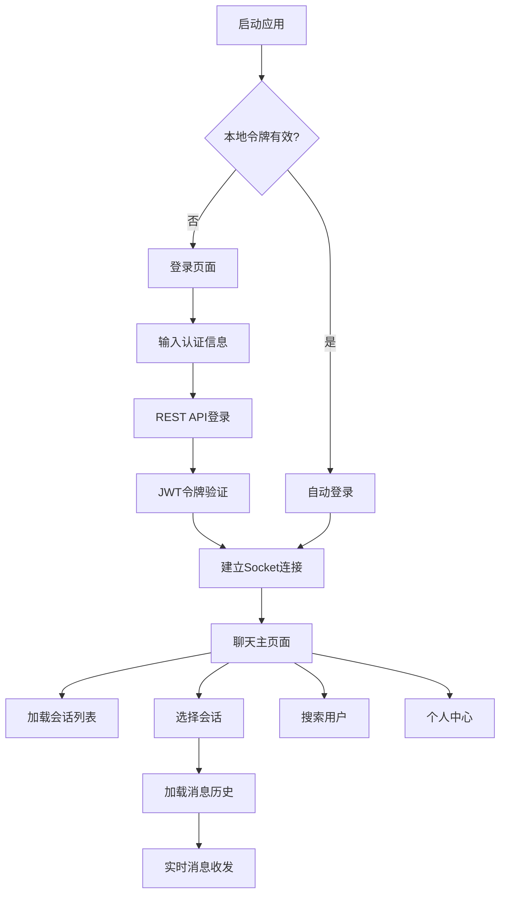

## 1. 产品概述

基于现有REST+Socket.IO后端架构的Flutter跨平台即时通讯客户端，支持Android、iOS、Web多端统一体验。提供实时消息收发、用户搜索、会话管理、消息历史等核心聊天功能，采用JWT认证与后端安全通信。

## 2. 核心功能

### 2.1 用户角色
| 角色 | 注册方式 | 核心权限 |
|------|----------|----------|
| 普通用户 | 邮箱注册/登录 | 发送消息、搜索用户、管理会话、查看历史记录 |

### 2.2 功能模块

核心页面包括：
1. **登录页面**: 用户认证、记住密码、自动登录
2. **聊天主页面**: 会话列表、消息展示、实时通信
3. **用户搜索页面**: 用户搜索、添加联系人
4. **个人中心**: 个人信息、设置、退出登录

### 2.3 页面详情

| 页面名称 | 模块名称 | 功能描述 |
|----------|----------|----------|
| 登录页面 | 认证表单 | 输入邮箱密码，支持记住密码功能，JWT令牌本地存储 |
| 登录页面 | 自动登录 | 检测本地有效令牌，自动跳转主页面 |
| 聊天主页面 | 会话列表 | 展示所有对话，按置顶和时间排序，显示未读数 |
| 聊天主页面 | 消息列表 | 展示选中会话的历史消息，支持下拉加载更多 |
| 聊天主页面 | 消息输入 | 文本输入、发送按钮、键盘适配 |
| 聊天主页面 | 实时通信 | Socket.IO连接管理，消息实时收发 |
| 聊天主页面 | 状态管理 | 在线状态、输入状态、消息发送状态 |
| 用户搜索页面 | 搜索框 | 支持按邮箱、昵称、拼音首字母搜索 |
| 用户搜索页面 | 搜索结果 | 展示匹配用户列表，支持发起聊天 |
| 个人中心 | 个人信息 | 显示当前用户基本信息 |
| 个人中心 | 设置选项 | 消息通知、主题切换、清除缓存 |
| 个人中心 | 退出登录 | 清除本地数据，返回登录页 |

## 3. 核心流程

### 用户认证流程
1. 用户输入邮箱密码点击登录
2. 客户端发送登录请求到REST API
3. 后端验证并返回JWT令牌
4. 客户端存储令牌并建立Socket.IO连接
5. 自动跳转到聊天主页面

### 消息收发流程
1. 用户在输入框输入消息内容
2. 点击发送或按回车键触发发送
3. 消息通过Socket.IO实时发送到服务器
4. 服务器转发给目标用户
5. 本地消息列表实时更新显示

### 会话管理流程
1. 进入应用自动加载会话列表
2. 点击会话切换到对应聊天界面
3. 自动标记会话已读状态
4. 支持会话置顶和删除操作

## 4. 用户界面设计

### 4.1 设计规范
- **主色调**: Material Design 3动态配色，支持深色/浅色主题
- **按钮样式**: 圆角矩形，主要操作为填充按钮，次要操作为边框按钮
- **字体系统**: 使用系统默认字体，标题18px，正文16px，辅助文字14px
- **布局风格**: 卡片式布局，列表项采用分割线分隔
- **图标风格**: Material Design图标库，线性图标为主

### 4.2 页面设计

| 页面名称 | 模块名称 | UI元素 |
|----------|----------|--------|
| 登录页面 | 认证表单 | 圆角输入框、渐变背景、品牌Logo居中显示 |
| 聊天主页面 | 会话列表 | 头像+用户名+最后消息+时间+未读数徽章 |
| 聊天主页面 | 消息列表 | 气泡式消息、时间分隔线、加载更多指示器 |
| 聊天主页面 | 消息输入 | 底部输入框+发送按钮，支持多行文本 |
| 用户搜索页面 | 搜索界面 | 顶部搜索栏+实时搜索结果列表 |
| 个人中心 | 设置界面 | 列表项设置菜单、用户信息显示卡片 |

### 4.3 响应式设计
- **移动端优先**: 针对手机和平板优化界面布局
- **适配策略**: 支持横竖屏切换，自动调整字体大小
- **触摸优化**: 按钮最小44px触摸区域，支持长按操作
- **平台适配**: 遵循Android Material Design和iOS Human Interface Guidelines

## 5. 技术特性

### 5.1 性能要求
- 应用启动时间 < 2秒
- 消息发送延迟 < 100ms
- 历史消息加载 < 1秒
- 支持离线消息缓存

### 5.2 安全要求
- JWT令牌安全存储
- 网络请求HTTPS加密
- 用户输入内容过滤
- 本地数据加密存储

### 5.3 兼容性要求
- Android 7.0+ (API 24+)
- iOS 13.0+
- Web浏览器支持Chrome、Safari、Firefox最新版本