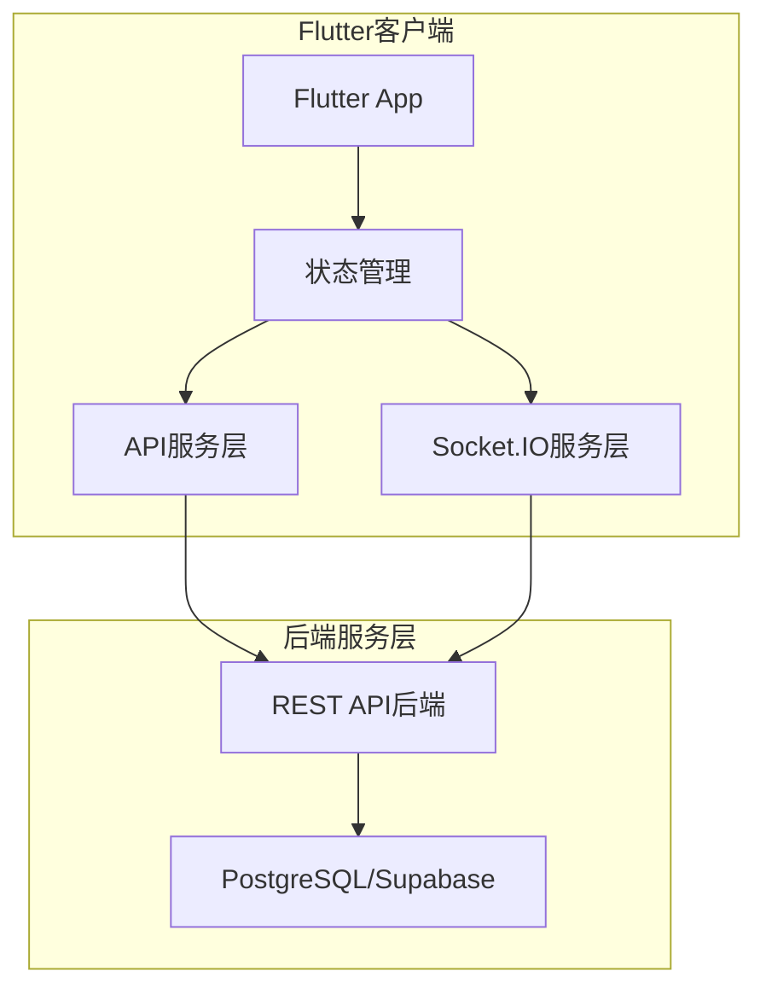
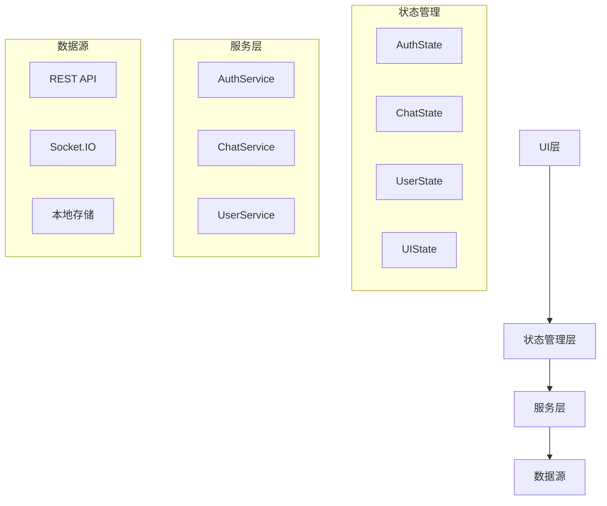

## 1. 架构设计



## 2. 技术栈描述

- **前端框架**: Flutter 3.16 + Dart 3.2
- **状态管理**: Provider 6.0 + Riverpod 2.4（响应式状态管理）
- **网络通信**: Dio 5.3（HTTP客户端）+ Socket.IO Client 2.0（实时通信）
- **本地存储**: SharedPreferences 2.2（轻量存储）+ Hive 2.2（结构化数据缓存）
- **依赖注入**: GetIt 7.6（服务定位器）
- **路由管理**: GoRouter 12.0（声明式路由）
- **UI组件**: Flutter Material 3（Material Design 3）
- **工具库**: FlutterSecureStorage 9.0（安全存储JWT令牌）

## 3. 路由定义

| 路由 | 页面 | 用途 |
|------|------|------|
| /login | LoginPage | 用户登录认证 |
| /chat | ChatPage | 主聊天界面 |
| /search | UserSearchPage | 用户搜索 |
| /profile | ProfilePage | 个人中心 |
| /settings | SettingsPage | 应用设置 |

## 4. 核心服务定义

### 4.1 认证服务
```dart
class AuthService {
  // JWT令牌管理
  Future<AuthResponse> login(String email, String password);
  Future<void> logout();
  Future<bool> isAuthenticated();
  Future<String?> getAccessToken();
  Future<void> refreshToken();
}
```

### 4.2 聊天服务
```dart
class ChatService {
  // Socket.IO连接管理
  Future<void> connect();
  Future<void> disconnect();
  void sendMessage(String to, String content);
  Stream<Message> onMessageReceived();
  Stream<List<String>> onOnlineUsersUpdated();
  
  // REST API调用
  Future<List<Message>> getMessageHistory(String peer, {int? before, int limit = 20});
  Future<void> markAsRead(String peer);
}
```

### 4.3 用户服务
```dart
class UserService {
  Future<List<User>> searchUsers(String query, {int page = 1, int pageSize = 10});
  Future<User> getCurrentUser();
  Future<List<Conversation>> getConversations();
  Future<void> deleteConversation(String peer);
  Future<void> pinConversation(String peer, bool pinned);
}
```

## 5. 数据模型定义

### 5.1 用户模型
```dart
class User {
  final String id;
  final String email;
  final String? nickname;
  final String? avatar;
  final String? nicknamePinyin;
  
  User({
    required this.id,
    required this.email,
    this.nickname,
    this.avatar,
    this.nicknamePinyin,
  });
}
```

### 5.2 消息模型
```dart
class Message {
  final String id;
  final String from;
  final String to;
  final String content;
  final DateTime timestamp;
  final String? clientId;
  final bool isOwn;
  
  Message({
    required this.id,
    required this.from,
    required this.to,
    required this.content,
    required this.timestamp,
    this.clientId,
    required this.isOwn,
  });
}
```

### 5.3 会话模型
```dart
class Conversation {
  final String peerId;
  final String peerNickname;
  final String? peerAvatar;
  final DateTime lastActive;
  final DateTime? lastTs;
  final int unread;
  final bool pinned;
  final DateTime? pinnedAt;
  final String? lastMessage;
  
  Conversation({
    required this.peerId,
    required this.peerNickname,
    this.peerAvatar,
    required this.lastActive,
    this.lastTs,
    required this.unread,
    required this.pinned,
    this.pinnedAt,
    this.lastMessage,
  });
}
```

## 6. 状态管理架构



### 6.1 认证状态
```dart
class AuthState extends ChangeNotifier {
  User? _currentUser;
  bool _isLoading = false;
  String? _error;
  
  User? get currentUser => _currentUser;
  bool get isAuthenticated => _currentUser != null;
  bool get isLoading => _isLoading;
  String? get error => _error;
  
  Future<void> login(String email, String password);
  Future<void> logout();
  Future<void> checkAuthStatus();
}
```

### 6.2 聊天状态
```dart
class ChatState extends ChangeNotifier {
  List<Conversation> _conversations = [];
  List<Message> _currentMessages = [];
  String? _activePeer;
  bool _isLoading = false;
  
  List<Conversation> get conversations => _conversations;
  List<Message> get currentMessages => _currentMessages;
  String? get activePeer => _activePeer;
  bool get isLoading => _isLoading;
  
  Future<void> loadConversations();
  Future<void> loadMessages(String peer);
  Future<void> sendMessage(String content);
  Future<void> markAsRead(String peer);
  void updateConversation(Conversation conversation);
  void addMessage(Message message);
}
```

## 7. API端点映射

### 7.1 认证相关
| Flutter方法 | REST端点 | 方法 | 描述 |
|------------|----------|------|------|
| login() | /api/auth/login | POST | 用户登录 |
| refreshToken() | /api/auth/refresh | POST | 刷新令牌 |
| logout() | /api/auth/logout | POST | 用户登出 |
| getCurrentUser() | /api/me | GET | 获取当前用户信息 |

### 7.2 消息相关
| Flutter方法 | REST端点 | 方法 | 描述 |
|------------|----------|------|------|
| getMessageHistory() | /api/messages/:peer | GET | 获取消息历史 |
| sendMessage() | Socket.IO: private_message | EMIT | 发送实时消息 |
| markAsRead() | /api/read/:peer | POST | 标记会话已读 |

### 7.3 用户相关
| Flutter方法 | REST端点 | 方法 | 描述 |
|------------|----------|------|------|
| searchUsers() | /api/users/search | GET | 搜索用户 |
| getConversations() | /api/conversations | GET | 获取会话列表 |
| deleteConversation() | /api/conversations/:peer | DELETE | 删除会话 |
| pinConversation() | /api/conversations/:peer/pin | POST | 置顶/取消置顶会话 |

## 8. Socket.IO事件映射

### 8.1 客户端发送事件
| 事件名 | 参数 | 描述 |
|--------|------|------|
| private_message | {to, content, clientId} | 发送私信 |
| mark_read | {peer} | 标记已读 |

### 8.2 客户端监听事件
| 事件名 | 参数 | 描述 |
|--------|------|------|
| private_message | Message | 接收私信 |
| online_users | List<String> | 在线用户列表更新 |
| unread_counts | {byPeer, total} | 未读数更新 |

## 9. 本地存储设计

### 9.1 安全存储（FlutterSecureStorage）
```dart
class SecureStorage {
  static const String _tokenKey = 'auth_token';
  static const String _refreshTokenKey = 'refresh_token';
  
  Future<void> saveToken(String token);
  Future<String?> getToken();
  Future<void> deleteToken();
  Future<void> saveRefreshToken(String token);
  Future<String?> getRefreshToken();
}
```

### 9.2 缓存存储（Hive）
```dart
class CacheStorage {
  // 消息缓存
  Future<void> cacheMessages(String peer, List<Message> messages);
  Future<List<Message>?> getCachedMessages(String peer);
  
  // 用户缓存
  Future<void> cacheUser(User user);
  Future<User?> getCachedUser(String userId);
  
  // 会话缓存
  Future<void> cacheConversations(List<Conversation> conversations);
  Future<List<Conversation>?> getCachedConversations();
}
```

## 10. 错误处理机制

### 10.1 网络错误处理
```dart
class NetworkException implements Exception {
  final int? statusCode;
  final String message;
  final dynamic data;
  
  NetworkException({this.statusCode, required this.message, this.data});
}
```

### 10.2 认证错误处理
```dart
class AuthException implements Exception {
  final String message;
  final AuthErrorType type;
  
  AuthException({required this.message, required this.type});
}

enum AuthErrorType {
  invalidCredentials,
  tokenExpired,
  networkError,
  unknown,
}
```

## 11. 性能优化策略

### 11.1 消息列表优化
- 使用ListView.builder实现虚拟滚动
- 图片消息使用缓存网络图片
- 消息分页加载，每次20条
- 本地消息缓存减少网络请求

### 11.2 状态管理优化
- 使用Selector减少不必要的UI重绘
- 实现防抖机制避免频繁API调用
- 使用异步状态管理避免阻塞UI

### 11.3 网络优化
- 实现请求重试机制（最多3次）
- 使用连接池复用HTTP连接
- 实现请求缓存避免重复请求
- 支持离线模式，本地缓存数据